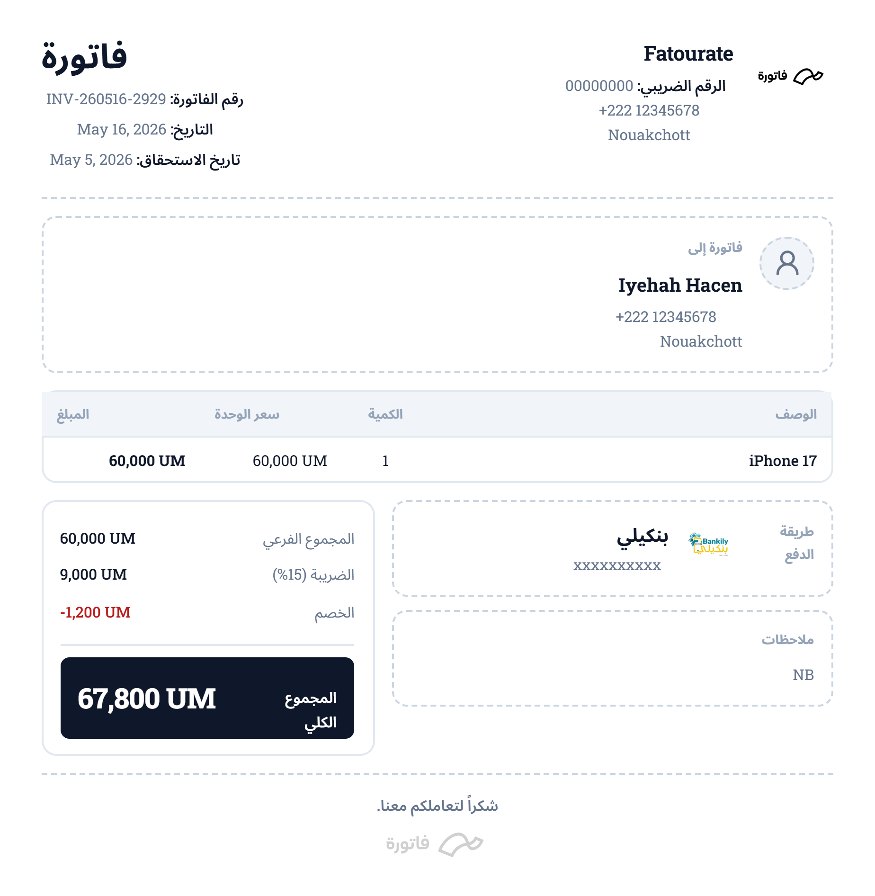

<div align="center">

<p>
  
  
  
  
</p>
</div>

> *Fatoore* is a fast web app for creating and managing invoices with support for Mauritanian context (MRU, local payment methods such as Bankily, Seddad, Masrvi, BimBank). Authentication and user records use **Firebase**; invoices and business branding profiles are stored **in the browser** (`localStorage`) per signed-in user.

## Example invoice

Premium invoice layout with Arabic RTL, accent styling, line items, tax, discount, and local payment details:

<p align="center">
  
</p>

*Sample: invoice `INV-260516-2929` — Standard size, default black accent, Arabic UI.*

## Requirements

- **Node.js** 20+ (or current LTS) and npm  
- A **Firebase** project with **Authentication** (e.g. Google provider) and **Firestore** enabled

### Environment variables

```env
NEXT_PUBLIC_FIREBASE_API_KEY=your_api_key_here
NEXT_PUBLIC_FIREBASE_AUTH_DOMAIN=your-project.firebaseapp.com
NEXT_PUBLIC_FIREBASE_PROJECT_ID=your-project-id
NEXT_PUBLIC_FIREBASE_STORAGE_BUCKET=your-project.appspot.com
NEXT_PUBLIC_FIREBASE_MESSAGING_SENDER_ID=123456789
NEXT_PUBLIC_FIREBASE_APP_ID=1:123:web:abc
NEXT_PUBLIC_FIREBASE_MEASUREMENT_ID=G-XXXXXXXXXX
```

## Data model notes

- **User profile** in Firestore (`users/{uid}`) is used after sign-in (see `getUserDocument` / `createUserDocument`).
- **Invoices** and **business profiles** are **not** synced to Firestore in the current codebase; they live in `localStorage` keyed by Firebase `uid`. Clearing site data or using another browser loses that local data unless you add cloud sync later.

## Invoice preview & export

Export is triggered from the invoice preview dialog ([`components/invoice/invoice-pdf.tsx`](components/invoice/invoice-pdf.tsx)). Implementation lives in [`lib/pdf-generator.ts`](lib/pdf-generator.ts) (PNG via `html-to-image`, PDF by embedding that image in `jspdf`).

The on-screen preview matches PDF and image downloads (same DOM capture).

### Template sizes

Choose a format from the toolbar on the invoice detail page or preview dialog. The choice is saved in `localStorage` (`rim-invoice-template-size`).

| Size | Label | Preview width | PDF page |
|------|--------|---------------|----------|
| **Small** | Ticket | 500px (receipt strip, auto height) | 5.5 × 8.5 in (140 × 216 mm) |
| **Medium** | Standard | A5 (148 mm) | A5 portrait |
| **Large** | Full | A4 (210 mm) | A4 portrait |

Typography and spacing scale per format. Content height grows with line items; long invoices auto-shrink to fit one printed page per format.

### Accent colors

Customize invoice branding from the toolbar (saved in `localStorage` as `rim-invoice-accent-color`):

- **Presets:** Black (default), Blue, Green, Orange, Gray  
- **Custom:** Native color picker (any hex)  
- **Apply to borders:** Optional checkbox to tint dashed/solid borders on cards, table, customer icon, payment icon, and business logo placeholder  

Accent applies to:

- Business name and logo placeholder  
- Table header background and labels  
- Customer and payment icon circles  
- Grand total bar  
- Optional borders when enabled  

### Fonts & languages

- **UI font** — Selected in the app settings menu; applies to the invoice preview (same stack as the rest of the app, with Arabic fallback).  
- **Languages** — Arabic, English, French (and more locales); full **RTL / LTR** layout with logical alignment.  

## Development

```bash
npm install
npm run dev
```

Open [http://localhost:3000](http://localhost:3000), sign in, create a business profile, then create an invoice and use **Preview** to try sizes, colors, PDF, and PNG export.
