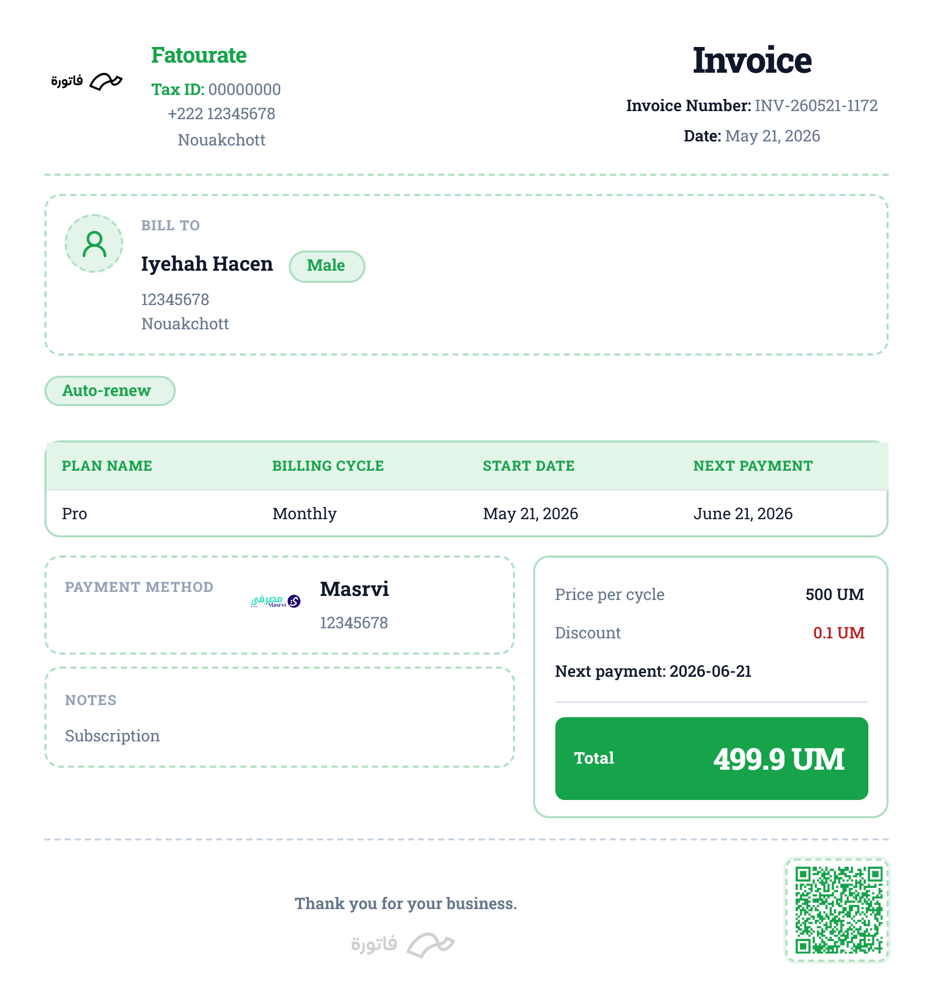
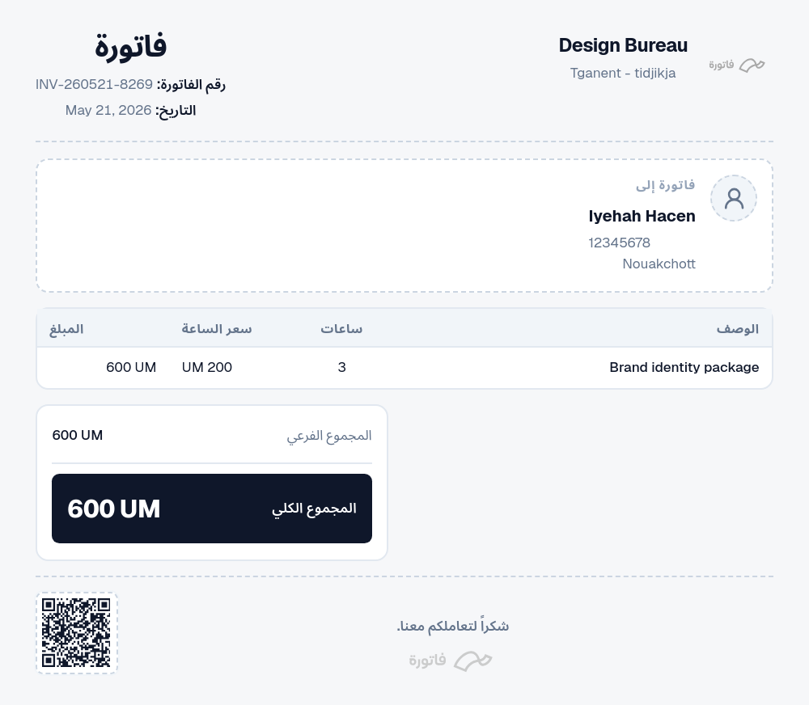
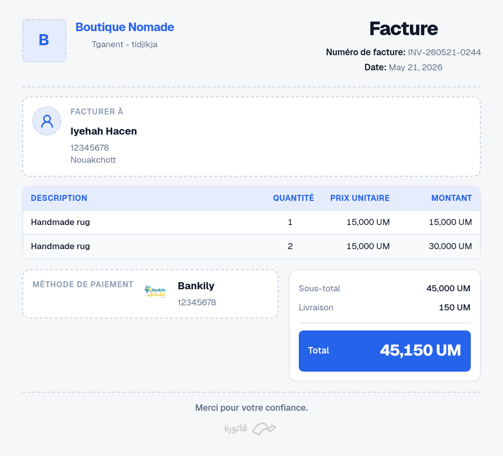
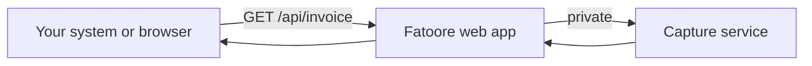

<div align="center">

<p>
  
  
  
  
</p>
</div>

Create and manage professional invoices for sales, subscriptions, services, bookings, and installments through an intuitive dashboard, or generate high-quality PNG/PDF invoices via HTTP API for ERP, CRM, and automation systems. Fully customizable currency, branding, and payment methods.

> Fast, polished invoices for your business — in the browser or from your own system.

<div align="center">
  <table>
    <tr>
      <td align="center">
        <br/>
        <sub>Installment • Orange • EN • Medium</sub>
      </td>
      <td align="center">
        <br/>
        <sub>Subscription • Green • EN • Medium</sub>
      </td>
      <td align="center">
        <br/>
        <sub>Service • Default • AR • Small</sub>
      </td>
      <td align="center">
        <br/>
        <sub>Sales • Blue • FR • Small</sub>
      </td>
    </tr>
  </table>
</div>


## How it fits your stack



- **You** send invoice data as URL query parameters (or use the UI).
- The **web app** validates data and renders the invoice layout.
- A **capture service** (separate deployment) screenshots that layout and returns PNG/PDF.

Full diagrams and setup: **[doc/architecture.md](./doc/architecture.md)**

## Requirements

- **Node.js** 20+
- **Firebase** project (Authentication + Firestore) for the signed-in web UI
- **Capture service** for API export (headless Chromium; see [integration guide](./doc/integration-guide.md))

### Environment (web app)

```env
NEXT_PUBLIC_FIREBASE_API_KEY=…
NEXT_PUBLIC_FIREBASE_AUTH_DOMAIN=…
NEXT_PUBLIC_FIREBASE_PROJECT_ID=…
NEXT_PUBLIC_FIREBASE_STORAGE_BUCKET=…
NEXT_PUBLIC_FIREBASE_MESSAGING_SENDER_ID=…
NEXT_PUBLIC_FIREBASE_APP_ID=…

# API export (when using capture service)
INVOICE_API_BASE_URL=https://your-public-app-url
RENDER_SERVICE_URL=https://your-capture-service-url
RENDER_SERVICE_API_KEY=shared-secret-with-capture-service
```

## Quick start

```bash
npm install
npm run dev
```

Open [http://localhost:3000](http://localhost:3000) — sign in, add a business profile, create an invoice, preview and export.

**API playground:** [/developers/invoice-api](http://localhost:3000/developers/invoice-api)

## Documentation

| Doc | Description |
|-----|-------------|
| [doc/README.md](./doc/README.md) | Documentation index |
| [doc/api-reference.md](./doc/api-reference.md) | Endpoints + **full query parameter table** |
| [doc/branding-and-layout.md](./doc/branding-and-layout.md) | Logo, labels, fonts, colors, sizes |
| [doc/architecture.md](./doc/architecture.md) | System communication (diagrams) |
| [doc/integration-guide.md](./doc/integration-guide.md) | Production setup & best practices |

## Logo & labels (short)

| Concern | API / UI |
|---------|----------|
| Logo | `businessLogo` URL + `showLogo=true` |
| Label language | `lang=en` \| `ar` \| `fr` |
| Brand color | `color=default` \| preset \| `#hex`, optional `applyBorders=true` |
| Layout size | `size=small` \| `medium` \| `large` (aliases `s`, `m`, `l`, …) |

Details: [doc/branding-and-layout.md](./doc/branding-and-layout.md)

## License

See repository license file.
