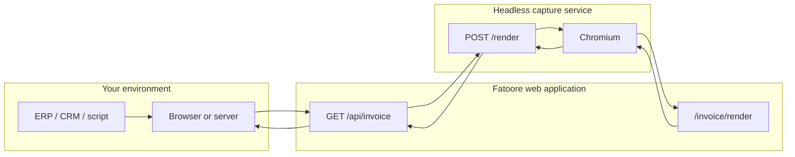
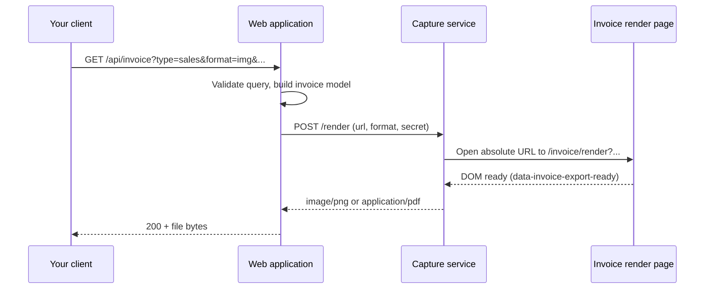
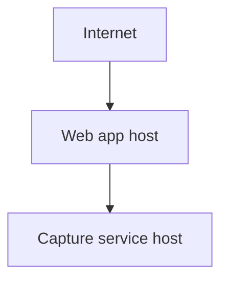

# Architecture

Fatoore turns structured data into printable invoices (PNG or PDF). You can use the web UI or call the public HTTP API from your own system.

## High-level flow

1. **Your system** builds a URL (or opens the playground) with invoice fields as query parameters.
2. The **web application** validates the request and builds a preview URL (`/invoice/render?…`).
3. The **capture service** opens that URL in headless Chromium, waits for the invoice layout to be ready, and returns PNG or PDF bytes.
4. The API returns the file to your client with the correct `Content-Type`.

The capture service is **not** exposed to the public internet for invoice creation. Only your app host calls it, using a shared secret.

## Sequence (API export)

## Components

| Component | Role | Public? |
|-----------|------|--------|
| Web application | UI, forms, `GET /api/invoice`, `/invoice/render` HTML | Yes |
| Capture service | Playwright screenshot / PDF pipeline | No (server-to-server only) |
| Invoice engine | Types, validation, totals (sales, subscription, …) | Used inside the app |

## Deployment model (provider-agnostic)

You typically run **two** pieces:

| Piece | Hosts | Notes |
|-------|--------|------|
| Web application | Any Node-compatible host (container, PaaS, VPS) | Serves Next.js; needs env for app URL and capture service URL |
| Capture service | Container host recommended | Needs Chromium system libraries; not required on your laptop for UI-only use |

Set the app’s **public base URL** so generated render links point to your production domain. Set **capture service URL** and **shared API key** on the app host only.

## Security boundaries

- **Public:** `GET /api/invoice` (no API key on the request today).
- **Private:** capture service `POST /render` — requires `Authorization: Bearer <secret>` (or equivalent body token).
- **Optional:** capture service may restrict which hostnames appear in the `url` field (`ALLOWED_RENDER_HOST`), so only your app’s domain can be opened.

## Related pages

- [API reference](./api-reference.md)
- [Integration guide](./integration-guide.md)
