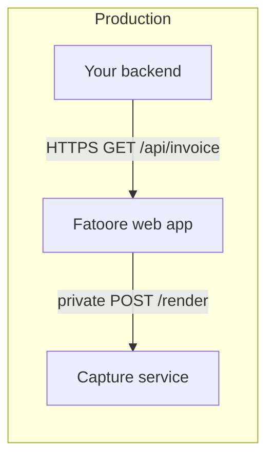

# Integration guide

Best practices for connecting your ERP, CRM, e-commerce stack, or scripts to Fatoore.

## Recommended architecture



- **Your clients** call only the **web app** URL (`/api/invoice`).
- The **capture service** stays private; firewall or allowlists restrict who can call it.

## Environment variables (web application host)

| Variable | Purpose |
|----------|---------|
| `INVOICE_API_BASE_URL` | Public URL of this app (used to build `/invoice/render` links for capture) |
| `NEXT_PUBLIC_APP_URL` | Optional fallback for absolute links |
| `RENDER_SERVICE_URL` | Base URL of your capture service (no trailing slash required) |
| `RENDER_SERVICE_API_KEY` | Shared secret — must match the capture service |
| `RENDER_SERVICE_TIMEOUT_MS` | Client timeout when calling capture (default ~55s) |

Firebase `NEXT_PUBLIC_FIREBASE_*` variables are only required for the signed-in web UI, not for anonymous API export.

## Environment variables (capture service host)

| Variable | Purpose |
|----------|---------|
| `RENDER_SERVICE_API_KEY` | Same secret as the web app |
| `ALLOWED_RENDER_HOST` | Optional hostname allowlist (e.g. `your-app.example.com`) |
| `RENDER_TIMEOUT_MS` | Playwright timeout (default 45s) |
| `PORT` | Set automatically on most PaaS hosts |

## Setup checklist

1. Deploy the **web application** with a stable HTTPS domain.
2. Deploy the **capture service** (Docker image with Chromium recommended).
3. Set `INVOICE_API_BASE_URL` to your public app URL.
4. Set `RENDER_SERVICE_URL` + matching `RENDER_SERVICE_API_KEY` on the app host.
5. Set `ALLOWED_RENDER_HOST` on the capture service to your app hostname (no `https://`).
6. Verify `GET https://your-app/health` on the capture service if exposed for ops — or use app `/api/invoice` smoke test.
7. Open `/developers/invoice-api` and export img/pdf once.

## Best practices

### Stable output

- Pass `createdAt` when you need the same invoice number across retries.
- Use `autoInvoiceNumber=true` unless you manage numbers in your system.
- Keep query order stable; caching keys use the full query string.

### URLs and encoding

- URL-encode query values; use `encodeURIComponent` for JSON blobs (`items`, `milestones`).
- Stay under the **12 000** character query limit; for very large payloads, split line items or wait for a future POST API.

### Logos and assets

- Host logos on HTTPS URLs your capture browser can load.
- In production, `INVOICE_API_BASE_URL` must be your public domain — not `localhost`.

### Performance

- Responses are cached 60s — burst identical requests are cheap.
- First capture after idle hosting may be slow (cold start); retry once.
- Prefer `format=img` for previews; `format=pdf` for downloads.

### Security

- Treat `RENDER_SERVICE_API_KEY` as a password; rotate if leaked.
- Do not expose the capture service URL in browser-side JavaScript.
- Plan for future API authentication on `/api/invoice` if you expose it on the open internet.

## Local development

Two processes:

| Process | Port (example) | Command |
|---------|----------------|---------|
| Web app | 3000 | `npm run dev` in `frontend/` |
| Capture service | 3001 | `npm run dev` in private capture repo |

```env
# frontend/.env.local
INVOICE_API_BASE_URL=http://localhost:3000
RENDER_SERVICE_URL=http://localhost:3001
RENDER_SERVICE_API_KEY=your-shared-secret
```

Capture service uses the same `RENDER_SERVICE_API_KEY` in its `.env`.

## Troubleshooting

| Symptom | Likely cause |
|---------|----------------|
| `apiKeyConfigured: false` on capture health | Missing `RENDER_SERVICE_API_KEY` on capture host |
| 503 / API key not configured | App or capture missing or mismatched secret |
| 403 URL host not allowed | `ALLOWED_RENDER_HOST` does not match app hostname in render URL |
| 500 Capture failed | Chromium issue, timeout, or validation error on `/invoice/render` |
| Empty logo | `showLogo=false`, bad URL, or blocked HTTP asset |

Add `debug=true` to the API query for richer 500 responses during setup.

## Payment methods (Mauritania-friendly)

`paymentMethod` is a string id shown with localized labels when recognized (e.g. `bankily`, `seddad`, `masrvi`, `bimbank`, `cash`). Pass `paymentDetails` for account numbers or instructions.

## See also

- [API reference](./api-reference.md)
- [Architecture](./architecture.md)
